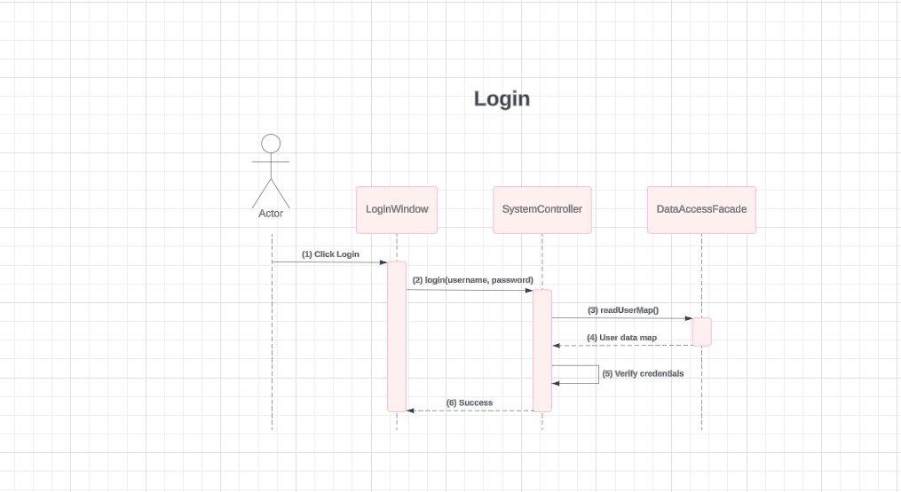
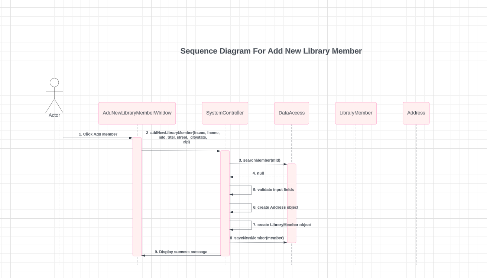
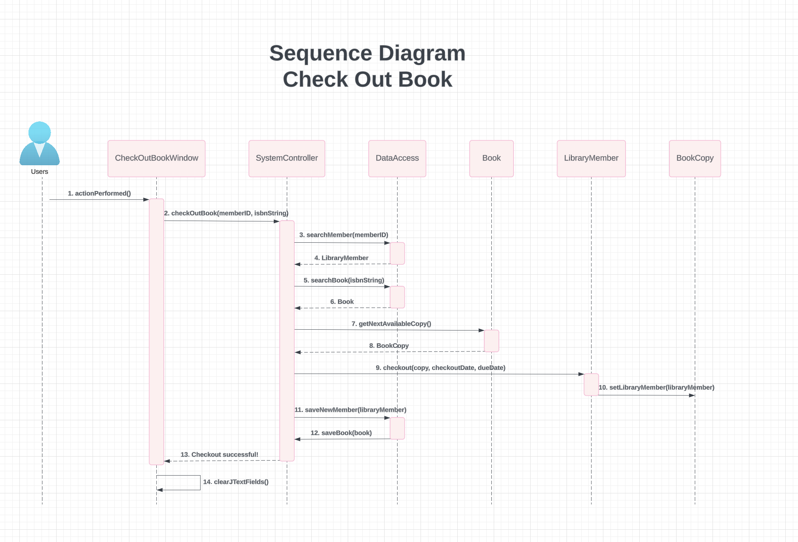

# Library Management System

## Overview

This project implements a Library Management System designed to facilitate the management of library operations such as member management, book checkout, and book inventory management. The system supports multiple user roles (Administrator and Librarian) with varying levels of access and functionality.

## Features

### Core Features

1. **Login**
    - Users are authenticated based on their credentials (ID and password).
    - Access levels include LIBRARIAN, ADMIN, and BOTH, determining UI features available.

2. **Add a New Library Member**
    - Administrators can add new members to the library system.
    - Member details include ID, first name, last name, address, and contact information.

3. **Checkout a Book**
    - Librarians can check out books for members.
    - Validates member and book availability, creates checkout records, and updates book status.

4. **Add a Copy of an Existing Book**
    - Administrators can increase the number of copies available for existing books in the library.

### Optional Features

1. **Add a Book to the Library Collection**
    - Administrators can add new books to the library, including ISBN, title, authors, checkout duration, and initial number of copies.

2. **Print Checkout Record**
    - Librarians can print the checkout record of a member, displaying details of all books currently checked out by that member.

3. **Check Overdue Copies**
    - Provides a special screen to check if copies of a book are overdue.
    - Displays information about overdue status and which member has the book.

## Development Steps

1. **Class Diagram**
    - Initial design includes classes such as `Member`, `Book`, `Library`, `CheckoutRecord`, `SystemController`, and `DataAccess`.
    - Relationships and attributes are defined based on use case analysis.

2. **Sequence Diagrams**
    - Created for each use case (e.g., Login, Add Member, Checkout Book) to outline interactions between actors (Administrator, Librarian), UI, SystemController, and DataAccess.
    - ## Login Sequence - Detailed Steps

The login sequence for the Library Management System involves several interactions between the user interface and the backend components. Here is a detailed step-by-step description of the process:

### Step-by-Step Sequence

1. **User Initiates Login:**
   - The user clicks the "Login" button on the login window.

2. **LoginWindow Sends Login Request:**
   - The `LoginWindow` sends a `login(username, password)` request to the `SystemController`.

3. **SystemController Requests User Data Map:**
   - The `SystemController` calls the `readUserMap()` method of the `DataAccessFacade` to retrieve the user data map.

4. **DataAccessFacade Returns User Data Map:**
   - The `DataAccessFacade` reads the user data from the storage and returns the user data map to the `SystemController`.

5. **SystemController Verifies Credentials:**
   - The `SystemController` verifies the provided username and password against the user data map.
   - If the credentials are valid, the `SystemController` prepares a success response.
   - If the credentials are invalid, the `SystemController` prepares a failure response.

6. **SystemController Sends Response to LoginWindow:**
   - The `SystemController` sends the login success or failure response back to the `LoginWindow`.

7. **LoginWindow Navigates to Main Application:**
   - Upon receiving a success response, the `LoginWindow` navigates the user to the main application interface.
   - If the login fails, the `LoginWindow` displays an error message to the user.
    - 

3. **User Interface Design**
    - Designed to support efficient workflow for each use case.
    - Utilizes TableView for displaying read-only checkout records.
    - Implemented using Java Swing based on sketches and UI plans.

4. **Data Access**
    - Serialization used for data persistence instead of a database.
    - DataAccessFacade provides methods for saving and retrieving serialized objects from storage.
    - ## Adding a New Library Member

### Steps to Add a New Library Member

1. **Open the Application**
   - Launch the Library Management System on your device.

2. **Navigate to Add Member**
   - In the application interface, locate and click on the "Add Member" section. This action will open the Add New Library Member window.

3. **Enter Member Details**
   - In the Add New Library Member window, enter the required details for the new member:
      - **First Name:** Enter the first name of the member.
      - **Last Name:** Enter the last name of the member.
      - **Member ID:** Provide a unique identifier for the member.
      - **Telephone Number:** Enter the contact telephone number of the member.
      - **Street Address:** Input the street address where the member resides.
      - **City:** Enter the city of residence for the member.
      - **State:** Specify the state or province of the member's address.
      - **Zip Code:** Input the postal code or zip code for the member's address.

4. **Add Member**
   - Once all required fields are filled, click on the "Add Member" button. This action will trigger the system to validate the input data and attempt to add the new member to the library database.

5. **Confirmation**
   - If the addition process is successful, a confirmation message will appear on the screen, indicating that the new member has been added successfully.

6. **Review and Manage Members**
   - After adding a new member, you can navigate to other sections of the application to review member details, manage loans, and perform other library management tasks.
   -  

### Additional Information

- **Error Handling:** If any required fields are left blank or if there are validation errors (e.g., invalid zip code format), the system will prompt you with appropriate error messages.
- **Feedback:** Your feedback is valuable to us! If you encounter any issues or have suggestions for improving the system, please feel free to contact our support team.

# Checkout Process Sequence Diagram

This sequence diagram illustrates the process of checking out a book in a library management system. It shows how user interaction triggers backend operations to validate and process a book checkout.

## Actors:
- **User/Customer**: Initiates the checkout process by interacting with the checkout interface.

## Components:
- **CheckOutBookWindow**: Graphical interface where users input member ID and book ISBN to initiate checkout.
- **SystemController**: Coordinates the checkout process by interacting with data access and business logic layers.
- **DataAccess**: Handles data retrieval and storage operations (searching for members and books, saving member data).
- **Book**: Represents the book being checked out.
- **LibraryMember**: Represents the library member performing the checkout.

## Sequence of Operations:
1. **User** triggers the checkout process by interacting with the `CheckOutBookWindow`.
2. `CheckOutBookWindow` forwards user inputs (`memberID` and `isbnString`) to `SystemController`.
3. `SystemController` verifies the existence of the `LibraryMember` by calling `DataAccess.searchMember(memberID)`.
4. If the member is found, `SystemController` searches for the book using `DataAccess.searchBook(isbnString)`.
5. Upon finding the book, `SystemController` retrieves the next available copy using `Book.getNextAvailableCopy()`.
6. `SystemController` then assigns the copy to the `LibraryMember` using `LibraryMember.checkout(copy, checkoutDate, dueDate)` and updates the database via `DataAccess.saveNewMember(libraryMember)` and `DataAccess.saveBook(book)`.
7. Finally, `SystemController` notifies the `CheckOutBookWindow` of successful checkout, which then clears input fields.
   
